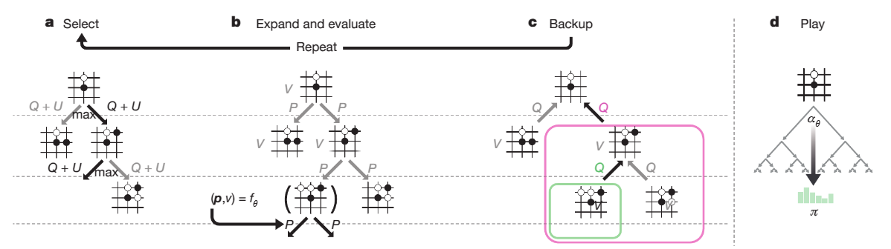
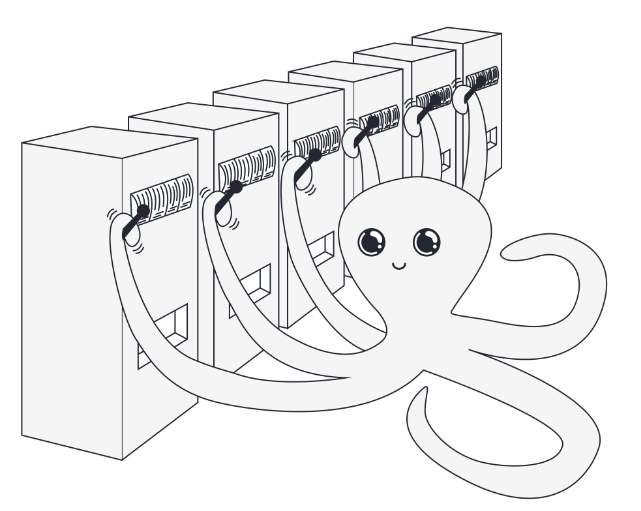
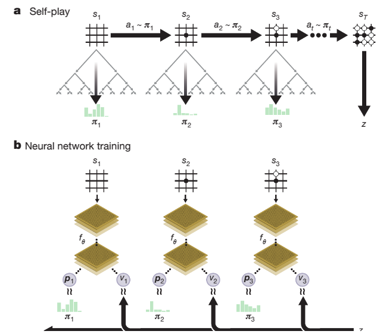

# 从头理解AlphaZero，MCTS，self-play，UCB

## 1. 背景介绍

2016年3月15日，Deepmind AlphaGo战胜了围棋大师李世石，引起了全球的轰动。Deepmind后续又推出了AlphaGo Zero，AlphaZero等，AlphaZero不再依赖于人类的经验知识，而是通过自我对弈，蒙特卡洛树搜索等技术，从零开始学习围棋，国际象棋，将棋等棋类游戏。这种方法不仅在棋类游戏中取得了巨大成功，也在其他领域取得了很好的效果（Alpha家族系列）。虽然AlphaZero通用且强大，但是其背后的算法却非常简单，让人不得不感叹大道至简。本文将从头开始介绍AlphaZero的核心技术，包括蒙特卡洛树搜索（MCTS），自我对弈（Self-Play），UCB等，并附上零基础的代码实现。

## 2. 蒙特卡洛树搜索（Monte Carlo Tree Search, MCTS）

蒙特卡洛树搜索是一种用于解决决策问题的启发式搜索算法，它可以高效的探索状态空间，同时利用评估值来指导搜索，试图做出更好的决策。用于强化学习时，可以得到提升的策略。下面我们以AlphaZero中的MCTS算法为例，介绍MCTS的基本步骤：选择（Select），扩展和评估（Expand and Evaluate），回溯（Backup）。


在开始前，我们先介绍MCTS中的几个基本概念：节点为棋盘的状态s，边为状态s下的动作a。节点s的边a记录了价值评估Q(s, a)，访问次数N(s, a)，动作概率P(s, a)。其中Q(s, a)也可以理解为动作a在状态s下的平均得分，对于棋类零和游戏而言，在-1到1之间。后面我们会介绍它们的计算更新方法。

### a. 选择（Selection）

选择是MCTS算法的第一步，从根节点(棋盘的当前状态$s_t$)开始，根据一定的策略不断选择节点(通过选择动作a)，直到达到叶子节点（leaf）。在AlphaZero中，选择策略为PUCT（Predictor Upper Confidence Bound for Trees）变体: $a_t = \arg\max_a (Q(s_t, a) + U(s_t, a))$，其中：

$$
U(s, a) = c_{puct}  P(s, a)  \frac{\sqrt{\Sigma_b N(s, b)}}{1 + N(s, a)}
$$

可以看出，$Q(s, a)$鼓励模型选择得分高的动作，$U(s, a)$鼓励模型探索（访问次数$N(s, a)$越小这项越大），它有一个因子$P(s, a)$，即动作概率，用于提升探索的效率，$c_{puct}$是一个超参数，用于平衡两者。下一节中，我们会进一步介绍动作选择策略。

### b. 扩展和评估（Expansion and Evaluation）

选择到叶子节点($s_l$)后，我们需要对叶子节点进行扩展和评估。具体来讲，我们用一个神经网络来预测当前叶子节点下的动作概率分布和状态价值：$(P(s_l, \cdot), V(s_l)) = f_{\theta}(s_l)$，其中$V(s_l)$可以理解为对当前状态的得分预测，在-1到1之间。将这些值存储下来，我们就完成了扩展和评估的过程。

需要注意的是，不同于传统的MCTS，AlphaZero用神经网络的预测$V(s_l)$代替了Simulation (rollout/playout), 这样显然提升了搜索的效率，同时也提升了搜索的准确性。

### c. 回溯（Backup / Backpropagation）
我们用$V(s_l)$来更新从根节点到叶子节点的所有$Q(s, a)$，因为正是这些a导致了叶子节点$s_l$的到达：

$$
Q(s, a) = \frac{N(s, a) \cdot Q(s, a) + V(s_l)}{N(s, a) + 1}
$$
并对访问次数$N(s, a)$加1。由于棋类游戏是零和游戏，从对手的角度来看，我们用$-V(s_l)$来更新其对应的$Q(s, a)$。

如果叶子节点$s_l$是一个终止节点（游戏结束），赢棋$V(s_l)=1$，输棋$V(s_l)=-1$，和棋$V(s_l)=0$。

### d. 走子 （play）
在我们多次执行MCTS，即多次（a, b, c）步骤之后，我们会得到各个动作的访问次数$N(s_t, a)$，从而可以计算出提升了的策略$\pi(s_t, a) = \frac{N(s_t, a)^{\frac{1}{\tau}}}{\Sigma_b N(s_t, b)^{\frac{1}{\tau}}}$，其中$\tau$是一个超参数，用于控制分布的平滑程度。我们可以根据这个策略来选择根节点$s_t$下实际执行的动作，即，走子。动作执行之后，我们将根节点移动到下一个状态$s_{t+1}$，并重复上述步骤。
$\pi(s_t, a)$是比神经网络的预测$P(s_t, \cdot)$更好的一个策略，所以也成为了它的训练目标。


## 3. 动作选择 （选读）
### 3.1 多臂老虎机 （Multi-Armed Bandits)


让我们回到强化学习的理想模型：多臂老虎机（Multi-Armed Bandits）。在多臂老虎机问题中，我们有$A$个臂，每个臂的奖励服从某个固定的分布（为了简化起见，我们假设均为伯努利分布，第$a$个臂的奖励均值为未知数$p_a$），我们的目标是找到一个策略，使得累积奖励最大化。我们面临的困难既是所谓的Exploration-Exploitation Dilemma：我们需要在已知的臂中选择估算奖励最高的臂（Exploitation），同时也需要探索其他臂，以便更好地估计其奖励（Exploration）。下面，我们介绍解决这个问题的经典算法：UCB


### 3.2 Upper Confidence Bound (UCB)
首先，我们回顾下霍夫丁不等式（Hoeffding's inequality），令$X_1, X_2, \cdots, X_n$为独立同分布的随机变量, $S_n = X_1 + \cdots + X_n$，且$X_i \in [0, 1]$，则对任意$\epsilon > 0$，有：
$$
\text{Pr}(|\frac{S_n}{n}- \mathbb{E}[X]| \geq \epsilon) \leq 2e^{-2n\epsilon^2}
$$
即：
$$
\text{Pr}(|\mathbb{E}[X] - \frac{S_n}{n}| \leq \epsilon) \geq 1 - 2e^{-2n\epsilon^2}
$$
令$\gamma = 2e^{-2n\epsilon^2}$，则$\epsilon = \sqrt{\frac{\log(1/\gamma)}{2n}}$，$\mathbb{E}[X]$的置信区间 （$1-\gamma$概率）为：
$$
[\frac{S_n}{n} - \sqrt{\frac{\log(1/\gamma)}{2n}}, \frac{S_n}{n} + \sqrt{\frac{\log(1/\gamma)}{2n}}]
$$
代入多臂老虎机，设我们使用了第$a$个臂$N(a)=n$次，$p_a$的估计值即为$\frac{S_n}{n}$，记为$Q(a)$，所有臂的使用次数为$T$，令$1/\gamma = T^\alpha$, 则$p_a$的置信区间为：
$$
[Q(a) - \sqrt{\frac{\alpha\log(T)}{2N(a)}}, Q(a) + \sqrt{\frac{\alpha\log(T)}{2N(a)}}]
$$
UCB算法选择置信区间上界最大的臂，即：
$$
a^* 
= \arg\max_a \left\{Q(a) + \sqrt{\frac{\alpha\log(T)}{2N(a)}}\right\}
$$
可以看出，UCB算法在面对不确定性时采用了一种乐观的策略（以置信区间的上界作为选择依据），具体来讲，$Q(a)$表示利用exploitation的部分，$\sqrt{\frac{\alpha\log(T)}{2N(a)}}$表示探索Exploration的部分，使用次数$N(a)$越小则这项越大，$\alpha$是超参数来权衡两者。

可以证明，UCB算法的后悔界（Regret Bound）为$O(\log(T))$，即在$T$次操作后，UCB算法与上帝视角最优累积奖励（总是选择$p_a$最大的那个臂）之间的差距期望不会超过$O(\log(T))$，为理论最优。

### 3.3 Predictor Upper Confidence Bound for Trees (PUCT)

将UCB算法应用到树上并引入策略$P(s,a)$，即，在节点状态$s$下选择动作$a$的概率$P(s,a)$，用以提升探索的效率，我们得到改进版的[PUCT](https://link.springer.com/article/10.1007/s10472-011-9258-6)变体：
$$
\text{PUCT}(s, a) = Q(s, a) + c_{puct}  P(s, a)  \frac{\sqrt{\Sigma_b N(s, b)}}{1 + N(s, a)}
$$
这个公式带有一定的经验性，$P(s, a)$的引入对于棋类游戏或者搜索空间很大的问题是非常有用的，因为它可以避免低效的盲目探索，提升搜索的效率。

# 4. 自我对弈（Self-Play）



自我对弈即自己和自己下棋（类似左右互搏），每走一步棋（Play），执行若干次MCTS，得到提升策略$\pi(s, a)$，然后根据这个策略来选择走子。依次轮换黑子和白子的角色，直到游戏结束。

MCTS用来提升策略，Self-Play用来评估策略，赢棋$z(s)=1$，输棋$z(s)=-1$，和棋$z(s)=0$ (即，上图b中v的训练目标为1，-1或0)。自我对弈可以生成大量的训练数据 $(s, \pi, z)$，用于训练神经网络$(\boldsymbol{p}, v) = f_{\theta}(s)$，网络结构一般为带有残差和batch norm的卷积神经网络，其损失函数为：
$$
L = (z - v)^2 - \boldsymbol{\pi}^T \cdot \log(\boldsymbol{p})
$$

每次自我对弈且训练模型之后，模型的棋力一定会提升吗？并不一定。为了解决这个问题，每次训练完毕之后，我们会用新模型来和旧模型下棋，如果新模型胜率超过一定阈值（例如55%），则认为新模型棋力提升，进入下一轮自我对弈训练，否则认为棋力没有提升，抛弃此次训练成果重新训练。这样，我们可以保证模型的棋力在不断稳步提升。

以上就是AlphaZero的全部内容了，简单而强大。不同于传统的深度强化学习方法，像DQN, Policy Gradient或者PPO，AlphaZero的方法更加简洁，仅依赖于MCTS和自我对弈。它的成功证明了简洁灵活的范式非常有效。
# 5. 从零实现AlphaZero

我们提供了一个简单的仅依赖Pytorch的AlphaZero实现，只有两个python文件，代码量不到1000行（其中游戏逻辑<500行，Alphazero<500行）：https://github.com/schinger/AlphaZero

## 5.1 游戏逻辑：game.py

以黑白棋（Othello）为例，定义了游戏的规则，合法落子，游戏结束，得分等。你可以很容易地实现其他游戏，比如五子棋，象棋，围棋等。

我们还实现了几个非常简单的对手：随机对手`RandomPlayer`，贪婪对手`GreedyOthelloPlayer`，人类对手`HumanOthelloPlayer`，以及支持对战的平台`Arena`，你可以用它来测试你的AI，或者自己在里面下棋。

另外，由于黑白棋是一个对称的棋类游戏，我们可以通过旋转和翻转棋盘来增加训练数据`getSymmetries`，通过标准化视角来统一棋盘状态`getCanonicalForm`，这样可以提升模型的泛化能力。

## 5.2 AlphaZero：alphazero.py

首先是`MCTS()`类，我们用字典存储节点和边的信息，用递归的方式实现了MCTS算法：`search(canonicalBoard)`返回当前canonicalBoard的值，如果当前canonicalBoard不是叶子节点，则递归调用`v = -search(next_canonicalBoard)`，即对对手的值取负。这个实现主要是为了简洁。如果为了高效，可以采用异步，并行，批量预测的方式来实现MCTS。

然后是网络结构`OthelloNNet`，我们用Pytorch实现了一个简单的带有batch norm的卷积神经网络，同时预测动作概率和状态价值。

最后是自我对弈类`SelfPlay()`，我们用它来生成训练数据$(s, \pi, z)$，训练模型，评估模型，保留还是抛弃模型等。

在普通的GPU上训练一天就可以得到一个强大的黑白棋AlphaZero：
```
python alphazero.py --train
```
你也可以直接和训练好的黑白棋AlphaZero下棋 （如果下赢了，记得联系我哦）：
```
python alphazero.py --play --round=2 --player1=human --ckpt_file=iter106.pth.tar --verbose
```
# 6. 展望

AlphaZero可以称得上是棋类领域的AGI，人类引以为傲的智商对于AlphaZero来说就是一个简单的参数（网络的深度，或者MCTS的步数），短时间的训练即可击败演化了千年的人类高手。下一步，将AlphaZero的方法应用到其他领域，例如LLM是值得期待的方向之一。


# 参考文献
- [Mastering the game of Go without human knowledge](https://www.nature.com/articles/nature24270.epdf?author_access_token=VJXbVjaSHxFoctQQ4p2k4tRgN0jAjWel9jnR3ZoTv0PVW4gB86EEpGqTRDtpIz-2rmo8-KG06gqVobU5NSCFeHILHcVFUeMsbvwS-lxjqQGg98faovwjxeTUgZAUMnRQ)
- [Mastering Chess and Shogi by Self-Play with a General Reinforcement Learning Algorithm](https://arxiv.org/pdf/1712.01815)